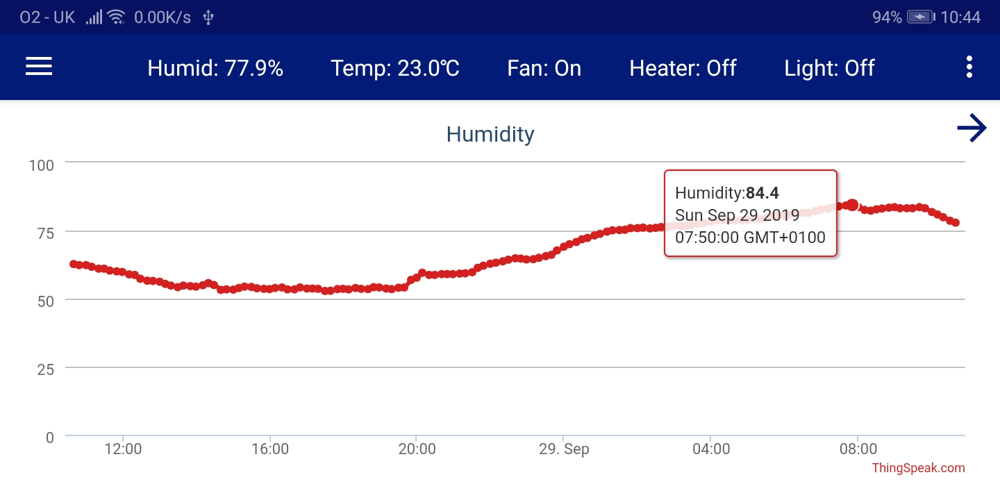
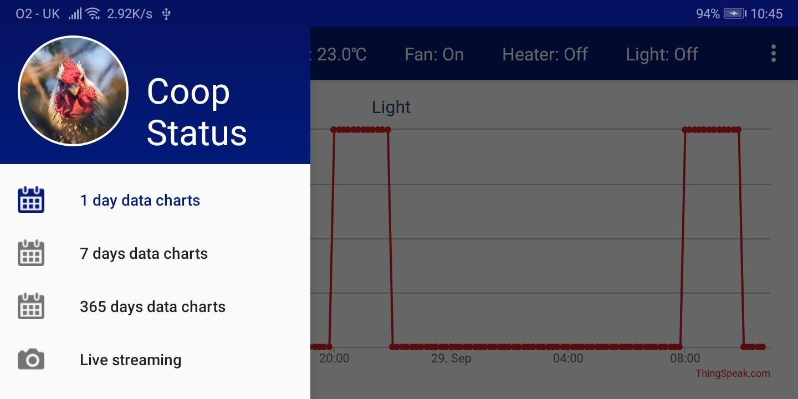

# CoopStat
Personal tool for accessing my family's chicken coop sensors readings and video stream.
Created using LiveData, ViewModel and Navigation components.

The app is showing the humidity/temperature/light sensors readings and graphs from the RaspberryPi/Python based station via the [ThingSpeak](https://thingspeak.com) service.
The MJPEG video stream is accessible using the [remote.it](https://remote.it) service as a relay.